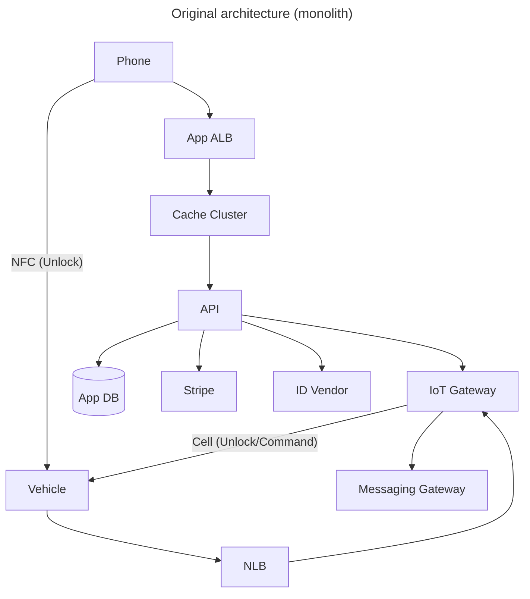
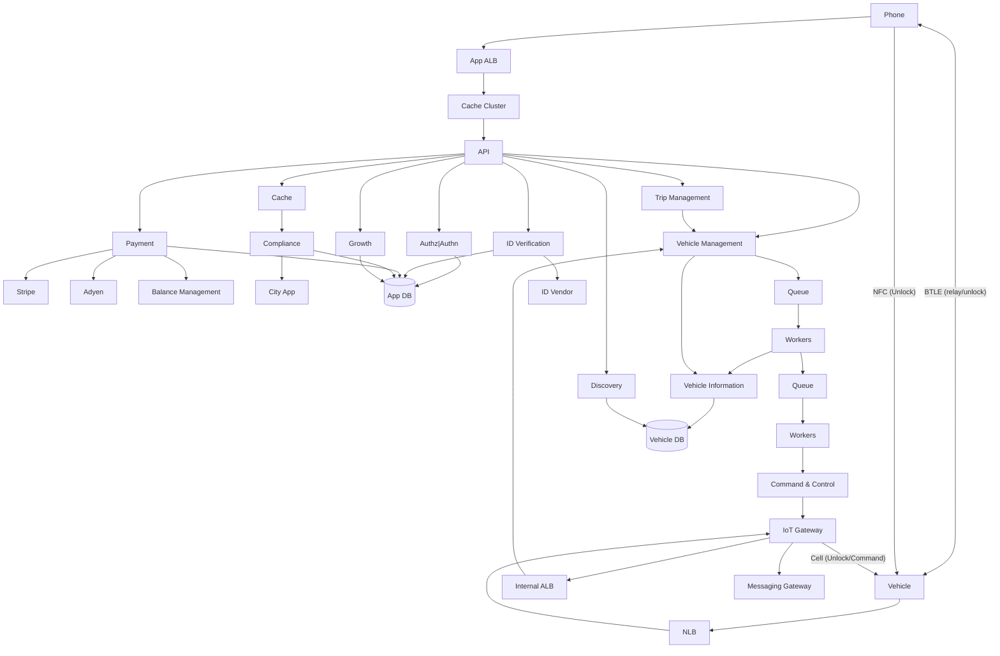

# Spin platform architecture: monolith to regional domain services

## Exec Summary

- **Goal:** Decomposing Spin's monolithic platform into regional domain services. Led as VP Engineering through 12-14 months of phased migration. Team scaled 23 to 140+ across 10 countries.
- **Rationale:** Expected 3x traffic, EU expansion, data residency obligations, or per-city compliance changes (which required tandem mobile releases). Monolith could not support these.
- **Work Done:** 4 shipped services (Compliance, Payments, Vehicle Management, Discovery), an async IoT command pipeline, and a regional deployment model with offline sync. Foundational work (observability, monitoring, runbooks, deploy pipelines) was built and stabilized before any service split.
- **Biggest Tradeoff:** Domain services with shared databases and versioned APIs over a full microservices + service mesh. Phased migration could be validated and rolled back. A mesh project would have run as a parallel migration alongside this one, compounding risk. Every new piece is a management risk.
- **Outcomes:** IoT comms failure rate down 14%. MTTR stable through the migration. Adyen live in some EU regions. EU and university markets unblocked. Faster Ghost vehicle recovery, lower vehicle loss. Mobile app rating 3.36 to 4.3 across the broader stability work.
- **Final Status:** project ended when Spin was acquired. Four services running independently in production. Two bundles (VM + VInfo + Trip, IoT + Command & Control) circumstantial, on the roadmap. One bundle (API + Auth + ID) by design. Growth cut earlier as priorities shifted to expansion.

## Problem Statement

**Architectural Baggage:** A single monolith carried a lot of the weight. It was difficult to _not_ introduce tight couplings and release dependencies.

**Release Coupling:** This was a major point of contention between teams. Having a monolith meant applying some change to one part of the system required co-ordination overhead. Releases were day-long affairs. Some things need to go slower and should be able to go slower.

**Fault Isolation:** Teams shipped together a lot. A bad user profile push could take down payments. No failure isolation between domains.

**Compliance Coupling:** Each city had bespoke rules for ID verification, speed limits, no-ride zones, parking, collection limits. Many lived in the mobile app. A city rule change required a tandem app release, and not every rider updated. We had riders in the field running outdated rules.

**Geographic Coupling:** everything ran out of one region. EU expansion brought potential data residency obligations the architecture had no path to.

## What Was Built

A set of domain services with the API as a routing layer. Four shipped as their own deployable units before the acquisition.

Payment, with Stripe and Adyen. Adyen went live in some EU regions. Different markets used different processors, scoped per region.

Compliance, as a server-side rule engine. The engine pushed city-specific configuration to the mobile app, which used the config to assemble onboarding wizards, ID verification flows, in-ride checks, and zone enforcement. The app became a renderer. Rules lived server-side. Rule changes took minutes. Each rule was designed to be skippable when an external dependency (e.g., the ID verification vendor) slowed or failed, usually negotiated with city authorities up front so a vendor outage never blocked riders.

Vehicle Management, owning vehicle state and a new async IoT command pipeline.

Discovery, serving vehicle availability for both customers and internal field operations.

The IoT path moved from synchronous dispatch on the user request path to a pub/sub-shaped server-side flow. Vehicle Management -> queue -> workers -> Command and Control -> IoT Gateway. We kept the native IoT wire protocol as firmware changes were outside our control.

BTLE was added as a fallback. When cell signal was weak (dense urban centers), the phone relayed the unlock to the vehicle. Under 1% of unlocks used it, but the hardware was already on the vehicle and the app proxy work was small. Cost-to-value was clear.

The resulting architecture was targeted to be a regional stack. Each region runs the full set of services and serves its users locally. An offline sync replicates cross-region: hourly for payments and user info, daily for trip and vehicle aggregates. Each region is authoritative for its own data.

## Tradeoffs

Service mesh versus domain services was the biggest internal disagreement. A full microservices architecture on a service mesh (Istio-class) is the architecturally clean answer. It is a separate engineering project alongside a major migration.
- Data coherency during the transition is still the application layer's problem.
- Schema versioning still requires rigor at every API boundary.
- Distributed tracing has to be built and operated before debugging gets manageable.
- A 40%-complete mesh gives you the complexity without the benefits.

We chose domain services with shared databases and versioned APIs. Each service was deployable, testable, and rollbackable in isolation. Teams could reason about their service without also reasoning about mesh config and sidecar policy. Some engineers pushed back hard. They understood the priorities (scale and resilience now, mesh plans deferred not closed) and stayed engaged.

Modular monolith versus split-and-refactor was the other one. The codebase was already modularized at boundaries, but communication was via library calls, not network calls. Library boundaries are easy to violate. Small couplings accumulate. To go modular-monolith-clean we would have had to refactor every internal call to a versioned contract, then split. Doing split and refactor in one move was faster, because releases had to keep going out through both phases either way.

Foundational work came first. Observability, monitoring, runbooks, and deployment pipelines were built while the system was still a monolith. Each service inherited working tooling on day one. This is why MTTR didn't degrade through the migration.

## Cost

**Opportunity Cost:** An effort like this normally carries quite a bit of opportunity cost. We were in a high growth phase and constantly hiring, which mitigated that to quite a degree.

**Latency Cost:** The async IoT pipeline added roughly 40ms on the command path. Failures cost us customers. Latency in this range did not.

**Bundled by Design:** Auth and ID Verification stayed bundled with the core API. Separating identity was the right architectural call, but extraction touched nearly every flow. ROI math didn't fit the timeline.

**Bundled by Circumstance:** Vehicle Information + Trip Management, IoT Gateway + Command & Control stayed bundled. They were on the roadmap to be split when the acquisition ended the work.

**Cut:** Growth was cut. We were in expansion phase, not optimization phase. Not enough data to drive growth experiments. The team was absorbed into higher-value work.

**Partial:** EU strict data residency was the goal. The architecture supported it. We ran one additional regional deployment before the acquisition. For data still flowing back, we operated under US-EU data transfer frameworks for legal cover. The architecture was the path. The acquisition came first.

## Success Metrics

- IoT comms failure rate dropped 14%.
- Vehicle loss rates dropped because Vehicle Management could be scaled and operated independently.
- Ghost vehicle recovery got faster.
- EU and university markets came online.
- Mobile app rating moved from 3.36 to 4.3 across the broader platform stability work.
- MTTR stayed stable across 12 to 14 months of phased migration. The foundational work was the reason.

Spin was acquired before the remaining splits shipped. We ran out of time, not conviction.
